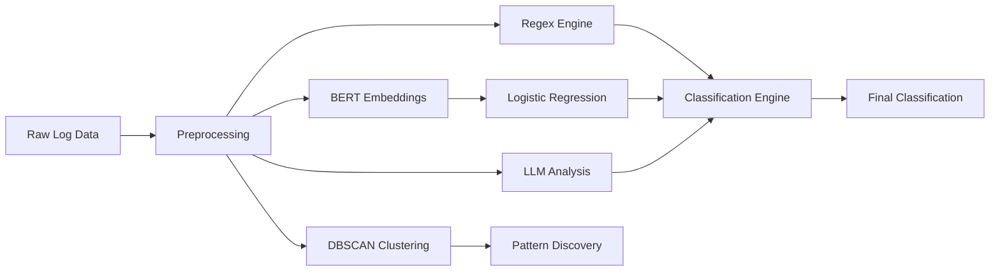

# Intelligent Log Classification System

An AI-powered log analysis system that combines Machine Learning, Rule-Based Classification, and Large Language Models (LLMs) to automatically categorize application and system logs.

The solution uses a hybrid classification architecture consisting of BERT embeddings, Logistic Regression, Regex-based classification, and LLM-assisted analysis to improve log categorization accuracy and reduce manual investigation effort.

---

## Business Problem

Modern applications generate thousands of log events every day.

Operations and engineering teams often spend significant time reviewing logs to identify:

* Application errors
* Database failures
* Authentication issues
* Network connectivity problems
* Infrastructure incidents
* Performance bottlenecks

Manual log analysis becomes increasingly difficult as log volume grows.

Organizations require automated approaches to classify logs and identify recurring patterns efficiently.

---

## Project Goal

Develop an intelligent log classification system capable of:

* Automatically categorizing log messages
* Detecting recurring log patterns
* Reducing manual log review effort
* Improving operational visibility
* Assisting incident investigation workflows

---

## Solution Overview

The platform uses a hybrid classification architecture.

Different techniques contribute to the classification process:

### Regex-Based Classification

Known patterns are classified using predefined regular expressions.

### Machine Learning Classification

BERT embeddings are used as feature representations and classified using Logistic Regression.

### LLM-Based Analysis

Logs that cannot be confidently classified are analyzed using an LLM to provide additional categorization support.

### Pattern Discovery

DBSCAN clustering is used to identify recurring log structures and generate candidate regex patterns.

---

# Architecture



---

## End-to-End Workflow

### Log Processing

1. Raw log messages are collected.
2. Log text is cleaned and normalized.
3. Known patterns are evaluated using regex rules.
4. BERT embeddings are generated for machine learning classification.
5. Logistic Regression predicts log categories.
6. Uncertain logs can be analyzed using an LLM.
7. Results are consolidated into final classifications.

### Pattern Discovery

1. Log embeddings are generated.
2. Similar logs are grouped using DBSCAN clustering.
3. Common patterns are identified.
4. Candidate regex rules are created from recurring structures.

---

## Key Features

### Hybrid Classification Architecture

Combines:

* Regex-based rules
* BERT embeddings
* Logistic Regression
* LLM-assisted classification

### Automated Log Categorization

Classifies logs into predefined operational categories.

### Pattern Discovery

Uses clustering to identify recurring log structures.

### Semantic Understanding

BERT embeddings capture contextual meaning within log messages.

### Rule-Based Processing

Provides fast classification for known log patterns.

### LLM-Assisted Analysis

Handles ambiguous and previously unseen log events.

---

## Example Log Classification

### Input Log

```text
ERROR: Database connection timeout after 30 seconds
```

### Classification Result

```json
{
  "category": "Database Error",
  "confidence": 0.94,
  "source": "Logistic Regression"
}
```

---

## Project Structure

```text
intelligent-log-classification-system/

├── data/
│   ├── raw_logs/
│   └── processed_logs/
│
├── preprocessing/
│
├── regex_engine/
│
├── embeddings/
│
├── classification/
│
├── clustering/
│
├── llm/
│
├── app.py
├── requirements.txt
├── README.md
└── .gitignore
```

---

## Technology Stack

* Python
* BERT
* Scikit-Learn
* Logistic Regression
* DBSCAN
* Regex
* LangChain
* Large Language Models (LLMs)

---

## Technical Concepts Demonstrated

* Text Classification
* Hybrid AI Systems
* BERT Embeddings
* Semantic Search
* Supervised Machine Learning
* Clustering Algorithms
* DBSCAN
* Pattern Discovery
* Log Analytics
* LLM Integration

---

## Example Categories

The system can classify logs into categories such as:

* Database Errors
* Authentication Failures
* Network Issues
* Application Errors
* API Failures
* Infrastructure Events
* Security Events
* Performance Warnings

---

## Getting Started

### Clone Repository

```bash
git clone https://github.com/<your-username>/intelligent-log-classification-system.git
cd intelligent-log-classification-system
```

### Install Dependencies

```bash
pip install -r requirements.txt
```

### Run Application

```bash
python app.py
```

---

## Learning Outcomes

This project demonstrates:

* Hybrid AI system design
* Text classification workflows
* BERT-based feature extraction
* Machine learning model integration
* Pattern discovery using clustering
* Combining rule-based and AI-based approaches
* Practical log analytics automation

```
```
